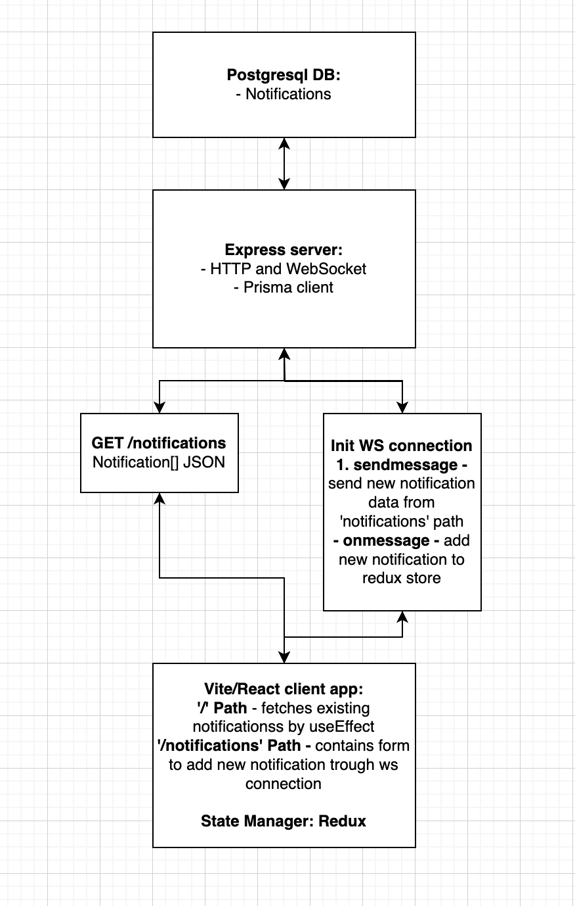

1. To run whole application trough docker run following command:
```./run_app.sh```

2. Notification list will be available by url:
```http://localhost:5173/```

3. Creating new notification can be done by url:
```http://localhost:5173/notifications```


**Diagram:**


